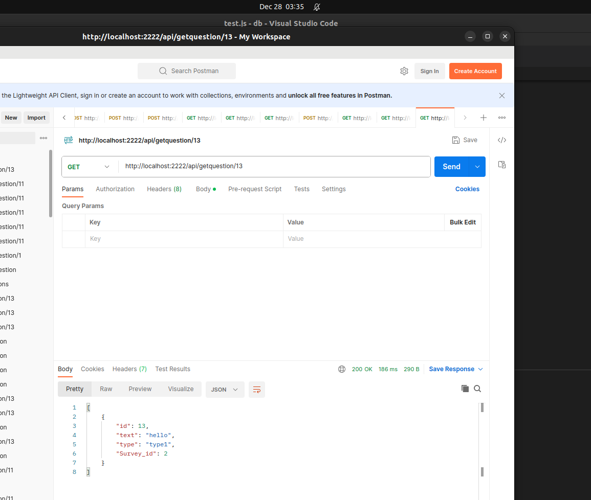
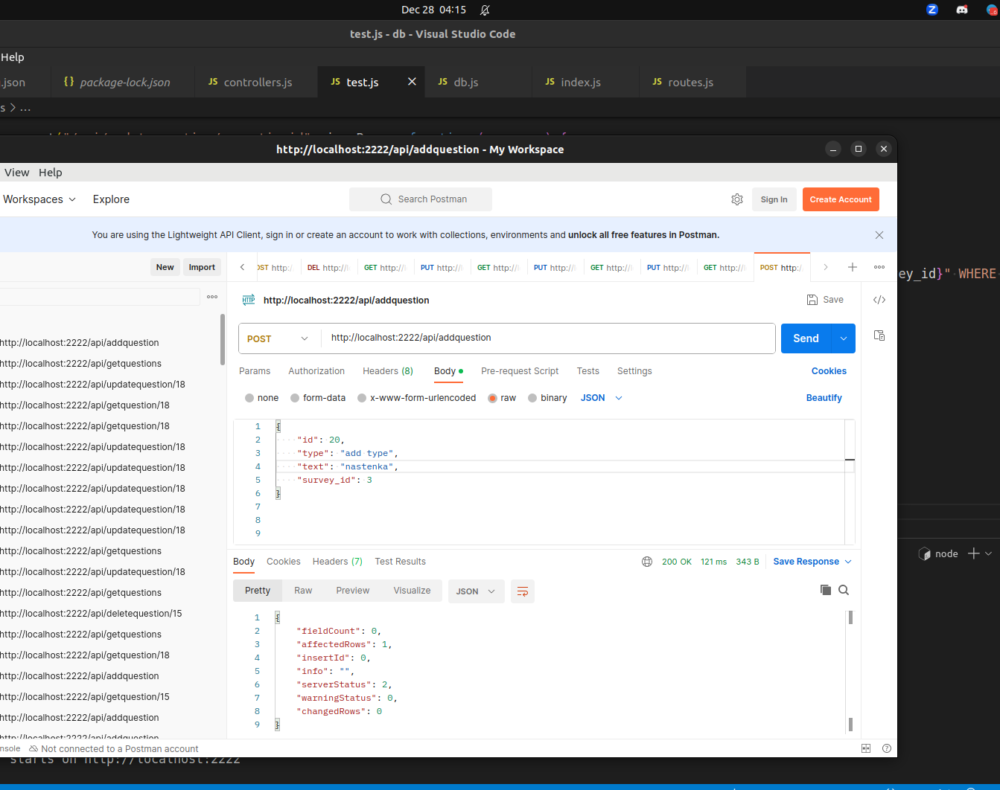
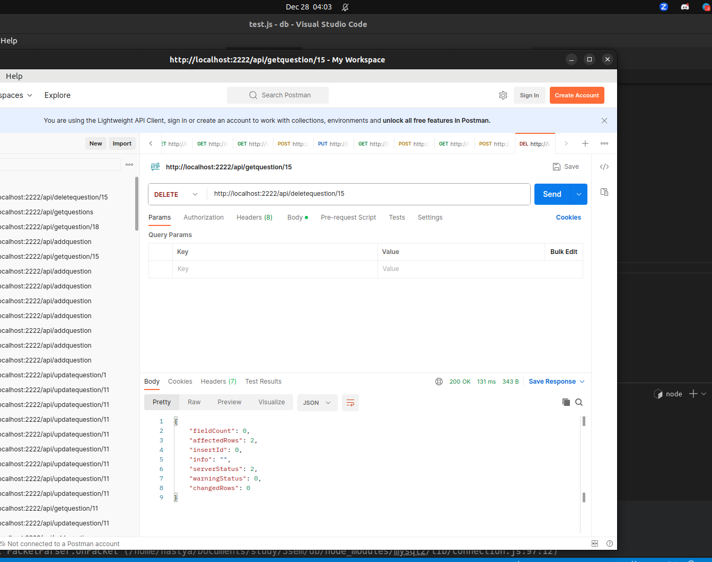
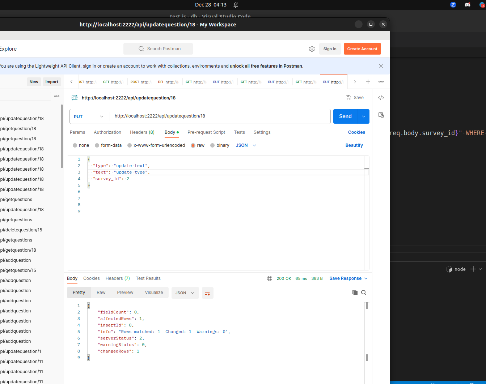

# Тестування працездатності системи

Тестування системи проводилось у IDE  Visual Studio Code за допомогою застосунку Postman

## Отримання всіх питань

## Отримання одного питання

## Додавання питання

## Видалення питання за id

## Змінити питання за id

