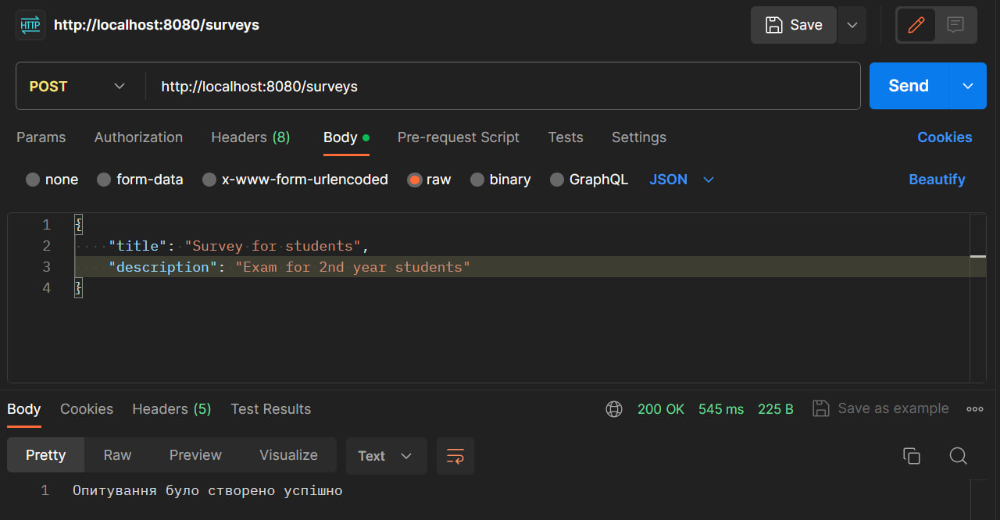
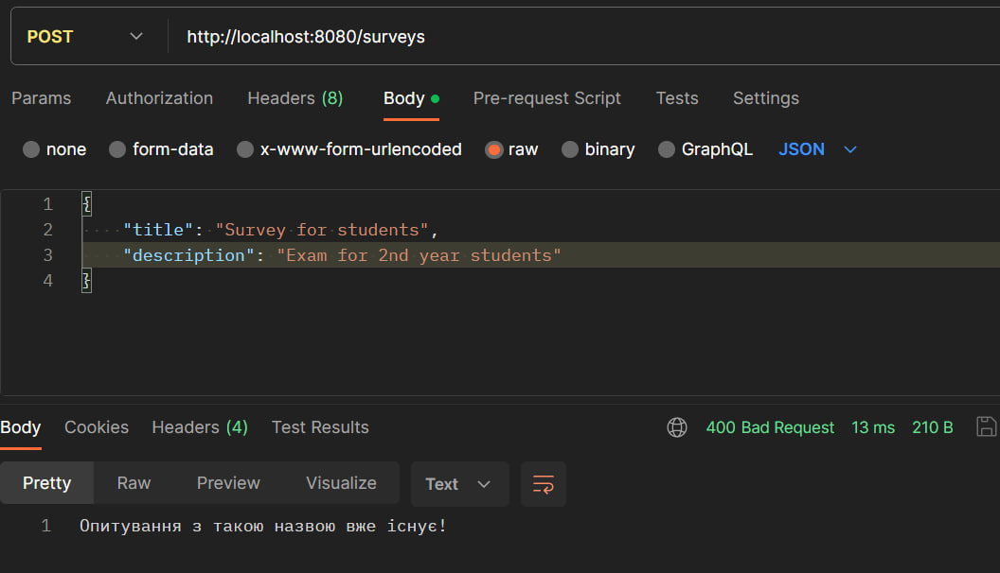
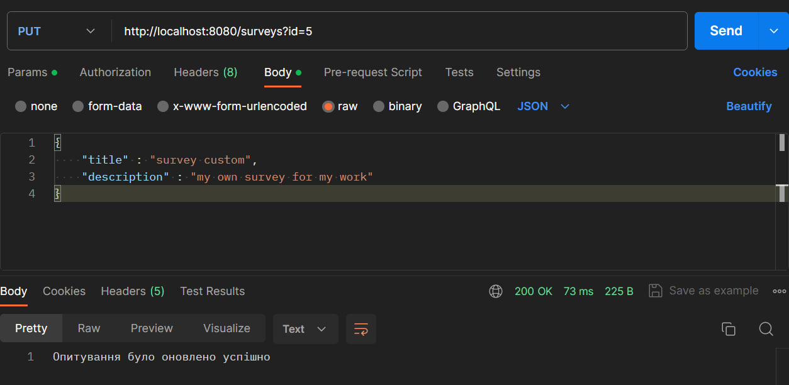
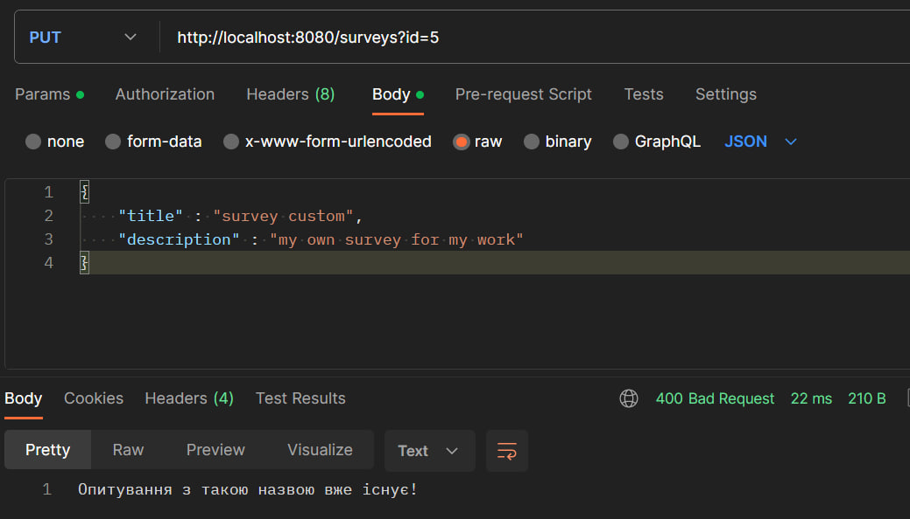
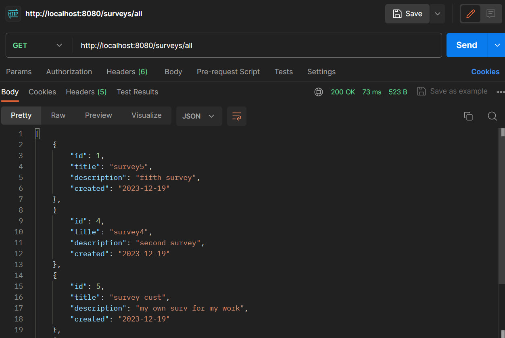
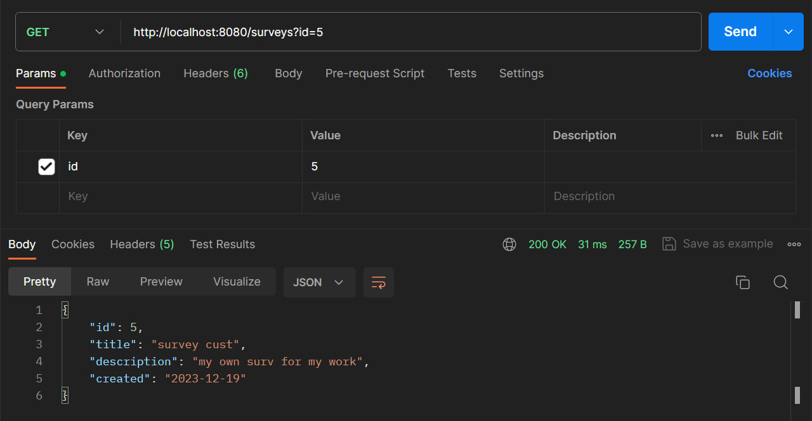
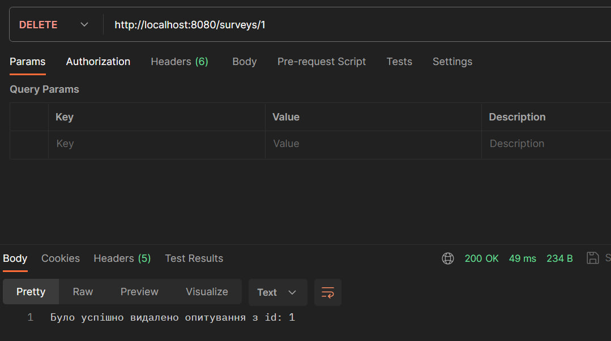
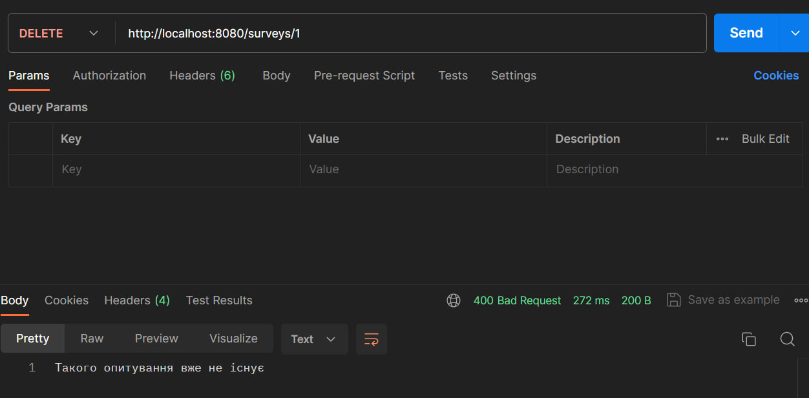

# Тестування працездатності системи

Тестування системи проводилось у IDE JetBrains IntelliJ IDEA за допомогою застосунку Postman

## Створення опитування
### Успішне створення

### Неуспішне створення

## Редагування опитування
### Успішне редагування

### Неуспішне редагування

## Отримання всіх опитувань
### Успішне отримання

## Отримання одного опитування
### Успішне отримання

## Видалення опитування
### Успішне видалення

### Неуспішне видалення

